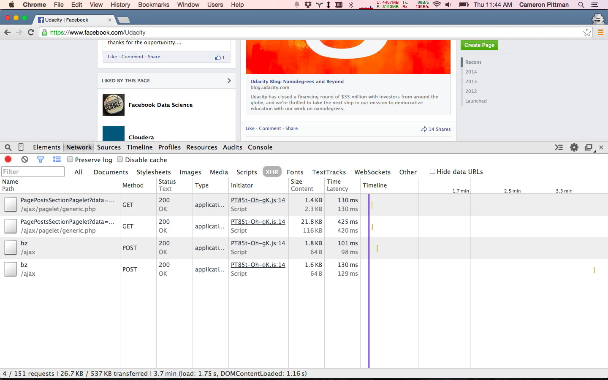
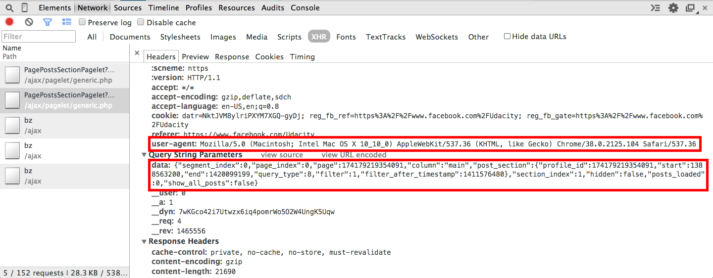
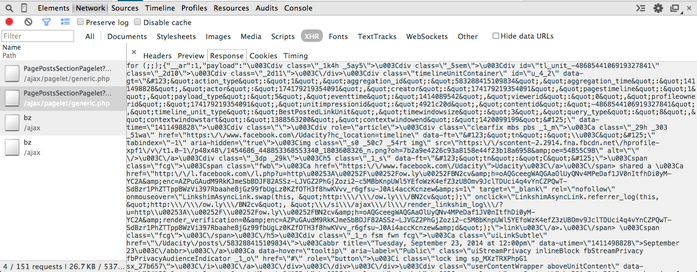

# Facebook's AJAX Request

Let's break down Facebook's PagePostsSectionPagelets AJAX request. Follow along with me in your own browser, and make sure that you're using the  [Udacity page](https://www.facebook.com/Udacity), not your Newsfeed (which runs AJAX requests under a different name).

    

The Network tab. Notice how I'm using the XHR  [filter](https://developer.chrome.com/devtools/docs/console#filtering-console-output)  to limit what I see.

    

The AJAX request I want to analyze. I'm looking at the second instance because the first returned nothing. My guess is that it came from the initial page load. The second was initiated when I scrolled down.

Starting in the Headers tab, we see the AJAX request's URL.

We can see that it's a GET request that resolved with a code of 200, meaning it succeeded. The  `data`  parameter (see below) provides more detailed information to Facebook about the specific request. And you'll see a field for user-agent, which describes your browser.

Clicking on the Preview tab, you can see Facebook's JSON response in a collapsed view. You can uncollapse the different properties (by clicking on the triangles next to them) to easily examine the response in more detail.

   

Checkout the  `payload`  property. It's HTML! This is new HTML for posts that get dynamically inserted into the page as you scroll down. You might see a few weird strings like  `/u003C`. They're unicode representations of characters like  `<`  or  `>`.

If you glance through the HTML, you should be able to identify the new stories that got added to the page.

And then we have the Response tab, which is the raw JSON response from Facebook.

Try exploring the PagePostsSelectionPagelets AJAX request further. What other pieces of useful information can you identify? Post your findings in the forums!

I've saved the Network requests from this example in a HTTP Archive (.har) file, which you can find in the Downloadables section. Download it and load it with the  [Chrome HAR Viewer](http://ericduran.github.io/chromeHAR/)  to inspect the same example that I analyzed!

#### Supporting Materials

-   [Udacity_Facebook.har](https://www.udacity.com/api/nodes/3183838548/supplemental_media/udacity-facebookhar/download)

